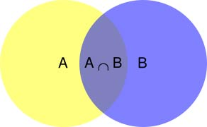

本文将简单的介绍朴素贝叶斯分类器（Naive Bayes Classifier）的数学原理，包括贝叶斯定理、朴素贝叶斯分类器、参数估计、Laplace 校准等。用 numpy 实现 Naive Bayes Classifier 并不困难，各类机器学习框架中大多也已有高可用的实现，因此本文不会再代码细节上多做赘述。

Naive Bayes Classifier 其实相当“朴素”，抛开对“机器学习”这一名词的无端恐惧，你就会发现其本只不过是一些列的概率计算 —— 下面就开始正文。

<!--more-->

## 贝叶斯定理

受过高中教育的人应该都知道贝叶斯定理，它是关于随机事件 A 和 B 的条件概率定理，其数学形式如下:
$$
P(A|B)=\dfrac{P(B|A)P(A)}{P(B)}
$$
其中有：

- P(A|B) 为已知 B 发生后 A 发生的条件概率，又被称作 A 的后验概率
- P(B|A) 为已知 A 发生后 B 发生的条件概率，又被称作 B 的后验概率
- P(A) 是 A 的先验概率或边缘概率
- P(B) 是 B 的先验概率

利用韦恩图能很直观地理解这一定义：

因为 $P(A|B)=\dfrac{P(A\cap B)}{P(B)},P(B|A)=\dfrac{P(A\cap B)}{P(A)}$，故有 $P(A|B)P(B)=P(B|A)P(A)$，其中 $P(A\cap B)$ 通常也记作 $P(AB)$ 或 $P(A,B)$。

## 朴素贝叶斯分类器

假设我们的已知数据集包括一系列特征向量（feature vector）以及与其对应的标记值（label value）。我们的期望是给定任一组新的特征值（feature value），我们能预测出标记空间（label space）中各标记值的取值概率 —— 并取概率最大的为我们的预测结果。

举个具体的例子，我们已知若干人的身高、体重、鞋码及其对应的性别 —— 这里面身高、体重、鞋码就是特征值，性别就是标记值，特征值的有序集合就是特征向量（例如 $(172cm,70kg,10\ inches)$），所有可能的标记值的集合就是标记空间（例如 $(male,female)$）—— 而朴素贝叶斯模型（在本例中）所要做的事情就是已知一些人的身高、体重、鞋码等信息及其对应性别，从这些数据中学习，最后对于给定的某个（新的）人的身高、体重、鞋码等信息预测他/她的性别。

那么如何从数据中学习并进行预测呢？~~根据标题不难猜到~~答案是利用 Bayes Theorem。将我们的特征向量记为 $F_1,\dots,F_n$，预测结果类别记为 $C$，则根据贝叶斯定理有：
$$
P(C|F_1,\dots,F_n)
=\dfrac{P(C)P(F_1,\dots,F_n|C)}{P(F_1,\dots,F_n)}
\propto{P(C,F_1,\dots,F_n)}
$$
其中分母部分 $P(F_1,\dots,F_n)$ 不依赖于 $C$ 且 $F_i$ 均为给定的定值，可以视为常数。

又根据链式法则有：

$$
\begin{aligned}
&P(C|F_1,\dots,F_n)\newline
&\propto{P(C,F_1,\dots,F_n)}\newline
&\propto{P(C)P(F_1,\dots,F_n|C)}\newline
&\propto{P(C)P(F_1|C)P(F_2,\dots,F_n|C,F_1)}\newline
&\propto{P(C)P(F_1|C)P(F_2|C,F_1)P(F_3,\dots,F_n|C,F_1,F_2)}\newline
&\propto{P(C)P(F_1|C)P(F_2|C,F_1)\dots{P(F_n|C,F_1,F_2,\dots,F_{n-1})}}
\end{aligned}
$$

这里我们引入了朴素贝叶斯模型的一个重要假设：所有朴素贝叶斯分类器都假定样本每个特征与其他特征都不相关。于是我们就能进一步化简上述公式：

$$
\begin{aligned}
&P(C|F_1,\dots,F_n)\newline
&\propto{P(C)P(F_1|C)P(F_2|C)\dots{P(F_n|C)}}\newline
&\propto{P(C)\prod_{i=1}^n{P(F_i|C)}}
\end{aligned}
$$

至此我们已经基本完成了朴素贝叶斯模型的建立。根据**最大后验概率准则**，我们的朴素贝叶斯分类器函数表达式如下：

$$
\operatorname{classify}(f_1,\dots,f\_n)=\underset{c}{\operatorname{argmax}}\ {P(C=c)\prod\_{i=1}^n{P(F_i=f_i|C=c)}}
$$

即寻找某一类别 $c$ 使得 $P(C=c)\prod_{i=1}^n{P(F_i=f_i|C=c)}$ 的取值最大化，这个类别 $c$ 就是我们对给定特征向量 $(f_1,\dots,f_n)$ 的预测分类。

# 参数估计

从最后的 $\operatorname{classify}$ 不难看出，朴素贝叶斯分类器的预测结果严重依赖于 $P(C),P(F|C)$ 的取值 —— 这些值被称作贝叶斯模型的参数。朴素贝叶斯模型训练步骤的主要工作就是计算这些参数。

对于 $P(C)$ 我们通常选择 $P(C)=\dfrac{1}{\lvert C\rvert}$ 或 $P(C)=\dfrac{\lvert\text{Samples}_{C=c}\rvert}{\lvert\text{Samples}\rvert}$。例如对于上述预测性别的例子，我们可以假设实际男女人数基本相等，从而有 $P(C)=0.5$；也可以假设实际男女比例与样本中的男女比例相等，从而有 $P(C=\text{male})$ 为“样本中男性数量/样本总数量”。

对于离散的特征值（例如二元特征值“有雨/无雨”或多元特征值“晴朗/多云/下雨”），我们通常使用统计学的方法 —— 例如 $P(F_i=\text{rainy}|C=\text{picnic})$ 的值为“外出野餐时下雨的样本数/外出野餐的样本数”。

对于连续的特征值（例如身高 0cm~300cm），我们通常假设其服从正态分布（Normal Distribution，又称高斯分布，Gaussian Distribution），从而可得如下公式：
$$
\begin{aligned}
P(F_i=f_i|C=c)&=\dfrac{1}{\sqrt{2\pi}\sigma_{c,i}}\operatorname{exp}\left(-\dfrac{(x_i-\mu_{c,i})^2}{2\sigma_{c,i}^2}\right)\newline
\mu_{c,i}&=\operatorname{Average}(F_i|C=c)\newline
\sigma_{c,i}&=\operatorname{Variance}(F_i|C=c)
\end{aligned}
$$

### Laplace 校准

对于离散的特征值，如果我们的样本中存在某些缺失的项 —— 例如 $P(F_i=\text{rainy}|C=\text{picnic})=0$ —— 那么在进行 $\prod$ 连乘时会导致其他所有特征的贡献都被抹除了，这是比较严重的误差。尽管下雨天外出野餐的概率并不高，但可能存在其他因素使得人们即使下雨天也要外出野餐。为了避免这种状况，我们给所有从未出现的特征值进行样本修正（sample correction），为其赋予一个至少为 1 的伪计数（pseudocount）。当伪计数为 1 时，我们将这种技巧成为 Laplace smoothing；当伪计数为任意值时，称之为 Lidstone smoothing。

关于朴素贝叶斯分类器的内容就这么多了，~~要不是我的代码太丑了~~可能会开放我用 numpy + pandas 实现朴素贝叶斯分类器的 Kaggle Kernel。

---

**参考文献：**

- [算法杂货铺——分类算法之朴素贝叶斯分类 (Naive Bayesian classification)](https://www.cnblogs.com/leoo2sk/archive/2010/09/17/naive-bayesian-classifier.html)

- [维基百科：贝叶斯定理](https://zh.wikipedia.org/wiki/贝叶斯定理)

- [维基百科：朴素贝叶斯分类器](https://zh.wikipedia.org/wiki/朴素贝叶斯分类器)

- [Wikipedia: Naive Bayes Classifier #Parameter Estimation](https://en.wikipedia.org/wiki/Naive_Bayes_classifier#Parameter_estimation_and_event_models)

- [Wikipedia: Additive Smoothing](https://en.wikipedia.org/wiki/Additive_smoothing)
