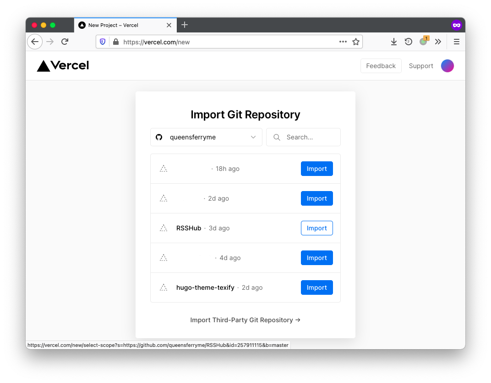
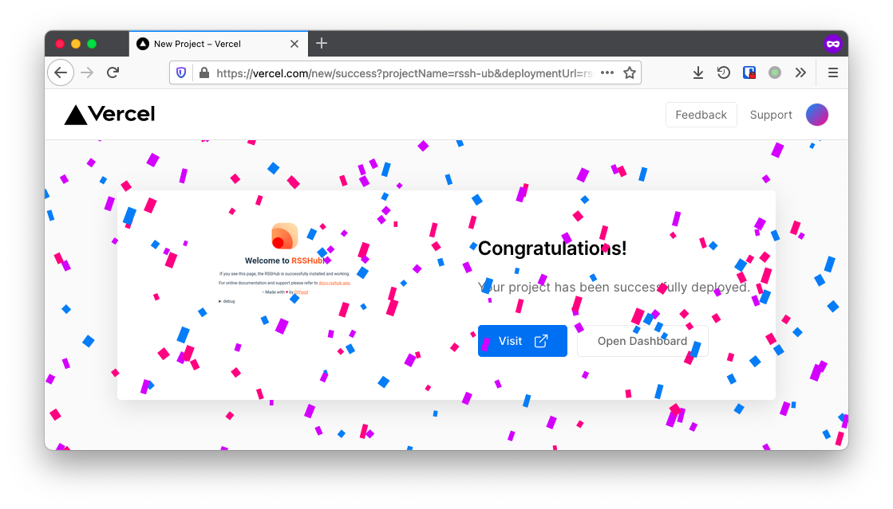
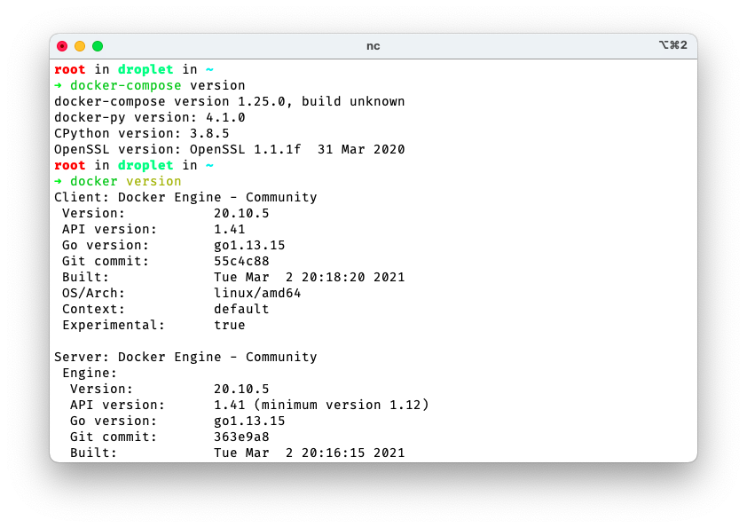
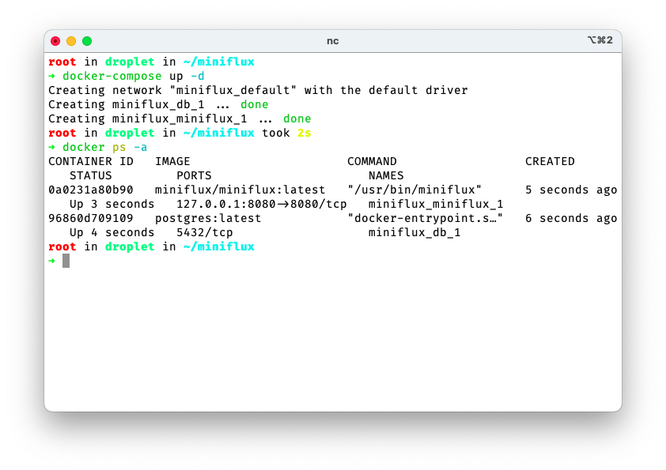

自从我明确意识到推荐算法的危害[^1]以来，我就一直以以 RSS 订阅作为我的主要信息来源。推荐算法所做的事就是不断地将你想要接收的信息反哺给你，导致你对世界的感知被扭曲，直到你陷入消费主义的囚笼。而 RSS 是一种能帮助你主动获取信息的工具 —— 掌握权在你，而非在推荐系统。此外，RSS 与独立网站一起也是对抗网络审查的天作之合。

长期以来我使用 Feedly 订阅 RSS，并辅以 RSSHub 来订阅一些不支持 RSS 的网站。但我最近遇到了以下问题：

- RSSHub 的免费官方实例用户较多，许多路由因遭到了目标站点反爬虫措施的反制而无法使用；
- 对于一些小众冷门的 Feed，Feedly 更新经常有延迟，有时甚至还会出现缺漏；
- 随着我订阅的 Feed 逐渐增多，其数量接近了 Feedly 免费用户能订阅的数量上限 —— 但 Feedly 每月订阅费用过于高昂；

为了解决上述问题，我决定自建 RSSHub，并使用 Miniflux 代替 Feedly。本文就将介绍我自建 RSSHub 与 Miniflux 的过程，以供参考。

<!--more-->

## RSSHub

我个人最推荐的 RSSHub 自建方式是通过使用 [Vercel](https://vercel.com/)。自建过程非常简单，也不几乎需要计算机相关的知识。如果自建好了 RSSHub，你也可以在社交网络上或者 [All About RSS](https://github.com/AboutRSS/ALL-about-RSS) 这里把你的自建实例分享出去供大家使用，并为官方实例缓解压力。

最简单的部署方式，就是在 RSSHub [文档](https://docs.rsshub.app/)里的部署页面找到[部署到 Vercel](https://docs.rsshub.app/install/#bu-shu-dao-vercel-zeit-now) 这一小节。你会看到一个一键部署按钮，点击它，跟着提示进行，你就可以自建一个 RSSHub 实例了。但本文推荐另一种部署方法：

1. 首先你需要一个 GitHub 账户。拥有账户并登录后，你需要到 RSSHub [仓库](https://github.com/DIYgod/RSSHub)页面，点击右上角「Fork」按钮，复刻一份到 RSSHub 源代码到你自己账户名下。

2. 其次你需要注册一个 Vercel 账户。注册完后到个人设置中的 Login Connections [页面](https://vercel.com/account/login-connections)将你的 Vercel 账户与 GitHub 账户绑定，这样 Vercel 就能导入你 GitHub 账户里的 RSSHub 复刻。

3. 绑定好账户后，在个人主页点击「[New Project](https://vercel.com/new)」新建项目，在这里找到你的 RSSHub 复刻，并点击「Import」按钮导入。

   [](rsshub-import.png)

4. 接下来都按照默认配置不需要改动，一直点击下去就可以了。当然你可以把项目名称修改成你喜欢的样子；如果还需要配置 YouTube 之类需要环境变量的路由，你也可以修改相关环境变量（Environment Variables），详见[文档](https://docs.rsshub.app/install/#pei-zhi)。配置好后最后一步点击部署（Deploy），等待一小段时间，成功后就可以见到类似下图的画面：

   [](rsshub-deploy-success.png)

   点击访问（Visit），你的浏览器就会跳转到你自建的 RSSHub 实例的地址啦～

5. 如果你不喜欢 `xxx.vercel.app` 这样的域名，你也可以对域名进行自定义（前提是你已经拥有一个域名），详见[文档](https://vercel.com/docs/custom-domains)。

~~最后，也欢迎你来使用我搭建的 RSSHub 实例 <https://rsshub.qufy.me>。~~ 此域名现已停止使用。

## Miniflux

自建 Miniflux 的门槛相较自建 RSSHub 要高一些，因为你需要一台个人服务器（VPS）。我目前使用的 VPS 是在 DigitalOcean 上购买的。可供选择的 VPS 服务商还有很多，价格、配置也不尽相同，需要你自己做决断。

如果你已经有了 VPS，并且能够通过 SSH 登录它，那么你就可以继续阅读以下 Miniflux 自建指南了。需要注意的是，如果你购买的是国内厂商（如阿里云、腾讯云等）的机子，那你就需要做好**备案域名**的心理准备，否则你将无法为你的 Miniflux 配置域名，自然也无法使用安全的 HTTPs 协议。我不愿意在国内备案我的域名，因此我选择了国外的 DigitalOcean。

第一步，登录你的 VPS。我们将会使用 Docker 和 Docker-Compose 来部署 Miniflux。Docker 官网提供了在 Ubuntu 上安装 Docker 的详尽[教程](https://docs.docker.com/engine/install/ubuntu/)（其他常见 Linux 发行版的教程也有），可供参考；如果你使用的是国内的 VPS，觉得从 Docker 官网下载太慢的话，也可以使用清华大学的 tuna 开源软件[镜像站](https://mirrors.tuna.tsinghua.edu.cn/help/docker-ce/)。然后再安装 `docker-compose`，Docker 官网同样有[教程](https://docs.docker.com/compose/install/)；如果你使用 Ubuntu 操作系统，也可以通过 `sudo apt install docker-compose` 来安装。安装完成后通过 `docker version` 和 `docker-compose version` 这两条命令来验证是否安装成功，若安装成功输出应如下图：

[](miniflux-install-docker.png)

第二步，编写 `docker-compose.yaml` 配置文件来部署 Miniflux。在你觉得合适的位置创建文件夹 `mkdir ~/miniflux`，进入文件夹 `cd ~/miniflux` 并创建配置文件 `touch docker-compose.yaml`。使用你喜欢的文本编辑器（例如 vim/nano）打开配置文件 `nano docker-compose.yaml`，将以下内容复制进去：

```yaml
version: '3'

services:

  miniflux:
    image: miniflux/miniflux:latest
    ports:
      - "127.0.0.1:8080:8080"
    depends_on:
      - db
    environment:
      - ADMIN_USERNAME=admin
      - ADMIN_PASSWORD=123456
      - BASE_URL=https://miniflux.app/
      - CREATE_ADMIN=1
      - DATABASE_URL=postgres://miniflux:secret@db/miniflux?sslmode=disable
      - RUN_MIGRATIONS=1

  db:
    image: postgres:latest
    environment:
      - POSTGRES_USER=miniflux
      - POSTGRES_PASSWORD=secret
    volumes:
      - miniflux-db:/var/lib/postgresql/data

volumes:
  miniflux-db:
```

这份配置基于 Miniflux 官方文档中的[示例](https://miniflux.app/docs/installation.html#docker)，但有所改进。还有几点提醒：

- 如果你希望直接通过 VPS 的公网 IP 访问到 Miniflux，你可以把端口（ports）部分配置中的 `127.0.0.1:` 删去，只留下 `8080:8080`，这样你就可以通过 `http://<your-public-ip>:8080` 访问了；
- 一定要**修改管理员密码** `ADMIN_PASSWORD`，这里的 `123456` 只是个示例，千万不要真的去使用这样的弱密码；
- 如果你要使用域名的话，将 `BASE_URL` 改成你自己的域名，否则请删去这一行；

第三步，当你配置好后，使用 `docker-compose up -d` 命令即可部署 Miniflux，部署成功输出应如下图。你也可以使用 `docker ps -a` 命令来查看容器状态，如果 Miniflux 和数据库（db）的状态（status）都是 `Up xxx seconds`，那就说明你的部署成功了。部署过程需要从 Docker Hub 拉取容器镜像，如果你使用国内 VPS 并感到下载速度过慢，可以考虑使用阿里云的[容器镜像加速服务](https://help.aliyun.com/document_detail/60750.html)。

[](miniflux-deploy.png)

最后一步，使用 Caddy 为你的 Miniflux 配置域名和 HTTPs。首先你需要到你的 DNS 服务商那里为你希望使用的域名新增一条 A 型记录，指向你部署有 Miniflux 的 VPS 的公网 IPv4 地址；如果你的 VPS 支持 IPv6 的话，你也可以再配置一条 AAAA 型记录，指向其 IPv6 地址。由于 DNS 配置生效需要一定时间（有时甚至长达数小时），这件事其实可以早点去做。

跟随 Caddy 官方[文档](https://caddyserver.com/docs/install)完成安装，然后你可以在 `/etc/caddy/Caddyfile` 这里找到 Caddy 的默认配置。同样使用你喜欢的文本编辑器打开该配置文件，写入以下三行：

```
https://miniflux.app
encode zstd gzip
reverse_proxy localhost:8080
```

将第一行修改成你自己的域名即可。修改好配置，使用命令 `sudo systemctl restart caddy.service` 重启 Caddy，此时 Caddy 应该读取到了你修改的配置，并开始帮你自动申请 HTTPs 证书了。稍等一小段时间，在你的浏览器里通过域名访问 Miniflux，如果成功进入登录页面（如下图），那么恭喜你：你部署成功了！

[](miniflux-deploy-success.png)

需要注意的是，现代 VPS 通常都默认开启了防火墙，而防火墙的 80、443 端口若没有开启就会导致 Caddy 申请证书失败。如果你在最后一步失败了，请检查一下你的 VPS 是否有防火墙。

> 写在最后：我在写作本文时，尽可能假设读者拥有最少的计算机相关知识，也就是假设读者是所谓的「小白」。我希望能有更多的人，包括不熟悉计算机技术的人，来接触并使用 RSS、通过 RSS 获取信息。这样写成的文章在专业人士眼里或许难免显得啰嗦而浅近，让各位见笑了。

---

[^1]: The Social Dilemma, <https://movie.douban.com/subject/34960008/>
